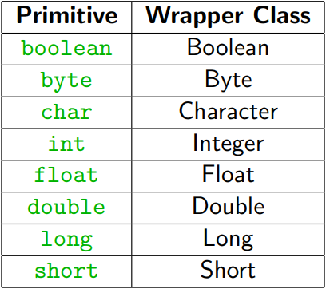

# Table of Contents
* [L01 - Introduction](#l01---introduction)
* [L02 - Strings](#l02---strings)
	* [Some Examples](#some-examples)
	* [Reserved Characters](#reserved-characters)
	* [Operations](#operations)
	* [Immutability](#immutability)
	* [Equality](#equality)
	* [Wrappers and Primitives](#wrappers-and-primitives)
	* [Boxing/Unboxing](#boxing/unboxing)
		* [Boxing](#boxing)
		* [Unboxing](#unboxing)
	* [Formatting](#formatting)
* [L03 - Input and Output (I/O)](#l03---input-and-output-i/o)
	* [Command Line Arguments](#command-line-arguments)
	* [Scanner](#scanner)
* [L04 - Arrays](#l04---arrays)
* [L05 - Files](#l05---files)
* [L06 - Methods](#l06---methods)
	* [Signature](#signature)
	* [Why tho?](#why-tho?)
	* [`static` keyword](#`static`-keyword)
	* [Scope](#scope)
	* [Mutation](#mutation)
	* [Overloading](#overloading)
* [L07 - Classes and Objects](#l07---classes-and-objects)

  * [Objects](#objects)
  	* [Static vs Instance](#static-vs-instance)
  * [Null](#null)
  * [Instantiation and Member Access](#instantiation-and-member-access)
  * [Constructors](#constructors)
  * [Standard Methods](#standard-methods)
* [L08 - Privacy](#l08---privacy)
	* [Mutability](#mutability)
	* [Modifiers](#modifiers)
		* [Private](#private)
		* [Protected](#protected)
		* [Public](#public)
	* [Getters and Setters](#getters-and-setters)
	* [Privacy Leaks](#privacy-leaks)
* [L09 - Inheritance](#l09---inheritance)
	* [Quick Reference](#quick-reference)
	* [Definition](#definition)
	* [Superclasses](#superclasses)
	* [Subclass](#subclass)
	* [Gist](#gist)
	* [Example: Chess](#example-chess)
	* [Super Keyword](#super-keyword)
	* [Shadowing](#shadowing)
	* [Overriding](#overriding)
		* [Why?](#why?)
* [L10 - Polymorphism and Abstract Classes](#l10---polymorphism-and-abstract-classes)
	* [The Object Class](#the-object-class)
	* [`instanceof` Keyword](#`instanceof`-keyword)
	* [Upcasting](#upcasting)
	* [Downcasting](#downcasting)
	* [Polymorphism](#polymorphism)
	* [Abstract Methods](#abstract-methods)
		* [Definition](#definition)
	* [Abstract Classes](#abstract-classes)
	* [Concrete Classes](#concrete-classes)
* [L11 - Interfaces](#l11---interfaces)
	* [How to Use Interfaces](#how-to-use-interfaces)
	* [Default Methods](#default-methods)
	* [Extending Interfaces](#extending-interfaces)
	* [A Common Use - Sorting - `Comparable<T>`](#a-common-use---sorting---`comparable<t>`)
* [L12 - Unified Modelling Language (UML)](#l12---unified-modelling-language-uml)
	* [What is it?](#what-is-it?)
	* [Class Representation](#class-representation)
		* [Class Attributes](#class-attributes)
		* [Class Methods](#class-methods)
	* [Class Relationships](#class-relationships)
		* [Association](#association)
		* [Multiplicity](#multiplicity)
		* [Example](#example)
		* [Aggregation](#aggregation)
		* [Composition](#composition)
	* [Generalization - Inheritance](#generalization---inheritance)
* [L13 - Generics](#l13---generics)
	* [Introduction](#introduction)
	* [The Comparable Interface](#the-comparable-interface)
	* [What does T mean?](#what-does-t-mean?)
	* [ArrayList](#arraylist)
	* [Using the ArrayList Class](#using-the-arraylist-class)
* [L14 - Exceptions](#l14---exceptions)
	* [Types of Errors](#types-of-errors)
	* [Runtime Errors](#runtime-errors)
		* [Best Solution](#best-solution)
	* [Exceptions](#exceptions)
		* [Exception Handling](#exception-handling)
		* [Generating Exceptions](#generating-exceptions)
		* [Defining Exceptions](#defining-exceptions)
		* [Chaining Exceptions](#chaining-exceptions)
		* [Types of Exceptions](#types-of-exceptions)
* [L17 - Software Testing and Design](#l17---software-testing-and-design)
	* [Unit Testing](#unit-testing)
		* [Why unit testing?](#why-unit-testing?)
* [L18/L19 - Design Patterns](#l18/l19---design-patterns)
	* [Analysing and Publishing a Pattern](#analysing-and-publishing-a-pattern)
	* [Common Design Patterns](#common-design-patterns)
	* [Template Method](#template-method)
		* [Strategy Pattern](#strategy-pattern)
		* ## [Factory Method Pattern](#factory-method-pattern)
		* [Observer Pattern](#observer-pattern)
* [L20 - Advanced Java and OOP Concepts](#l20---advanced-java-and-oop-concepts)
	* [Enums (enumerated types)](#enums-enumerated-types)
		* [Usage](#usage)
		* [Accessing](#accessing)
		* [Tying other Information](#tying-other-information)
	* [Variadic Parameters](#variadic-parameters)
	* [Functional Interfaces](#functional-interfaces)
	* [Lambda Expressions](#lambda-expressions)
	* [Method Reference](#method-reference)
	* [Streams](#streams)
		* [Operations](#operations)
	* [You will not be expected to write code on anything from these notes on this lecture.](#you-will-not-be-expected-to-write-code-on-anything-from-these-notes-on-this-lecture.)
* [L21 - Games](#l21---games)
	* [Sequential Programming](#sequential-programming)
	* [Event Driven Programming](#event-driven-programming)
		* [Examples of event-driven systems](#examples-of-event-driven-systems)
	* [Asynchronous Programming](#asynchronous-programming)
	* [Entity Component Approach](#entity-component-approach)
* [Exam Tips](#exam-tips)
	* [Week 1](#week-1)
	* [Week 2](#week-2)
	* [Week 3](#week-3)
	* [Week 4](#week-4)
	* [Week 5](#week-5)
	* [Week 6](#week-6)
	* [Week 7](#week-7)
	* [Week 9](#week-9)
	* [Week 10](#week-10)
	* [Week 11](#week-11)
	* [Exam Structure](#exam-structure)
		* [Question 1 (24 Marks)](#question-1-24-marks)
		* [Question 2 (30 Marks)](#question-2-30-marks)
		* [Question 3 (22 marks)](#question-3-22-marks)
		* [Question 4 (24 marks)](#question-4-24-marks)
		* [Question 5 (20 marks)](#question-5-20-marks)
# L01 - Introduction
[← Return to Index](#table-of-contents)


Yeah

# L02 - Strings
[← Return to Index](#table-of-contents)


*[Java Documentation]( https://docs.oracle.com/javase/8/docs/api/java/lang/String.html)*

Strings store sequences of characters

## Some Examples

```java
String s1 = "This is a String";
String s2 = "This is " + "also a String";
```

Unlike Python, you can't use single quotes

## Reserved Characters

Characters like `"` are reserved (because you start and end a string with it)

You need to escape them if you want to use them in a string

```java
"Hit that, she a "FEFE"" /* error, compiler thinks string ends at the second " */
"Hit that, she a \"FEFE\"" /* good */
```

Other common reserved characters: `\n`, `\t`

## Operations

The addition operator `+` can concatenate the string representation of two *objects* (using the `toString()` method inherited by every class)

```java
int a = 1;
String s = "a = " + a; /* good */
```

Keep in mind:

```java
"1 + 1 = " + 1 + 1 /* equates to 1 + 1 = 11 */
"1 + 1 = " + (1 + 1) /* equates to 1 + 1 = 2 */
```

Operator precedence still holds

## Immutability

Strings are immutable; once created, they can’t be modified, only replaced. An important point to note here is that, while the `String` object is immutable, **its reference variable is not.** So that's why, in the above example, the reference was made to refer to a newly formed `String` object.

```java
String str = "knowledge";
String s = str; // assigns a new reference to the same string "knowledge"
str = str.concat(" base"); /* NEW string, prev one is lost cause no other references*/
```

As applications grow, *it's very common for String literals to occupy large area of memory, which can even cause redundancy.* So, in order to make Java more efficient, **the JVM sets aside a special area of memory called the "String constant pool".**

When the compiler sees a `String` literal, it looks for the `String` in the pool. If a match is found, the reference to the new literal is directed to the existing `String` and no new `String` object is created. The existing `String` simply has one more reference. Here comes the point of making `String`objects immutable:

In the `String` constant pool, a `String` object is likely to have one or many references. *If several references point to same String without even knowing it, it would be bad if one of the references modified that String value. That's why String objects are immutable.*

*[Source and further reading](https://stackoverflow.com/questions/8798403/string-is-immutable-what-exactly-is-the-meaning)*

The String class is marked **final** so that nobody can override the behaviour of its methods.

## Equality

All classes in Java are actually pointers, or references. To check equality between two objects we use the `equals` method inherited from the god of classes, `Object`.

```java
String s = "Hello";
String s2 = new String("Hello");
System.out.println(s.equals(s2));
```

## Wrappers and Primitives 

Java provides “wrapper” classes for primitives. Primitives are things you're familiar with such as:

`int`, `double`, `char`

To conform with the "Object Oriented Model" these procedural conventions are **wrapped up** in a class representing the primitive type. **Provides extra functionality for primitives**, at the expense of very very very slight computational efficiency.



Has some nice stuff, but parsing is the most used one by far:
```java
Integer.parseInt("10");
Double.parseDouble("3.141592");
Boolean.parseDouble("TruE");
```

## Boxing/Unboxing

### Boxing

The process of converting a primitive to its equivalent wrapper class

### Unboxing

The process of converting an instance of a wrapper class to its equivalent primitive type.

Just remember that primitives types are the OG and you're effectively '**boxing**' it up with OOP classes.

## Formatting

```java
System.out.format("%2$d %<05d %1$d %3$10s", 10, 22, "Hello");
/*"22 0002210 Hello"
```


# L03 - Input and Output (I/O)
[← Return to Index](#table-of-contents)


## Command Line Arguments

Just like in C:

```java 
public static void main(String[] args)
```

args is a variable that stores command line arguments

```java
java MyProg Hello World 10

This fills the args variable with three elements, "Hello", "World" and "10"
For multiword Strings, remember to use quotes
Also note that "10" is a String, not an int
```

## Scanner

*[Documentation](https://docs.oracle.com/javase/8/docs/api/java/util/Scanner.html)*

`Scanner` is a class that allows for powerful input parsing.

```java
import java.util.Scanner;
Scanner scanner = new Scanner(System.in);
String s = scanner.nextLine();
boolean b = scanner.nextBoolean();
int i = scanner.nextInt();
double d = scanner.nextDouble();
```

# L04 - Arrays
[← Return to Index](#table-of-contents)


*[Documentation](https://docs.oracle.com/javase/8/docs/api/java/util/Arrays.html)*

As simple as can be

```java
int[] ints1 = {10, 20, 30, 40};
int[] ints = new int[100];
String[] strings = new String[100];

int x = ints[0];
int x = ints[-1]; // Gives out of bounds error

import java.util.Arrays;

int[] n1 = {1, 2, 3};
int[] n2 = {1, 2, 3};
Arrays.equals(n1, n2);
Arrays.sort(n1);
System.out.println(Arrays.toString(n1));

```

Arrays are references! Manipulating one reference affects all references

# L05 - Files
[← Return to Index](#table-of-contents)


```java
import java.io.FileWriter;
import java.io.PrintWriter;
import java.io.IOException;

try (PrintWriter pw = new PrintWriter(new FileWriter("test.txt"))) {
	pw.println("Hello World");
	pw.format("My least favourite device is %s and its price is $%d",
	"iPhone", 100000);
} catch (IOException e) {
	e.printStackTrace();
}

```

Not expected to remember exact code for exam, scaffolding provided.

# L06 - Methods
[← Return to Index](#table-of-contents)


## Signature

*The name of a method, and the number and type of its parameters*

```java
<privacy?> <static?> <return type> <method name>(<arguments>)
```

- public and static are default
- Every method needs a return type (`int`, `double[]`, `void`...)
- Methods can have zero or more arguments
- You must include the return statement if it is not `void`
- Must be defined in a class
- Represents the class performing an action

## Why tho?

- Prevents code **duplication**

- Improves **readability**
- Makes code **reusable** and **portable**
- Easier to **debug**
- Gives “important code” a useful **name**

## `static` keyword

- Indicates a **constant**, **variable**, or **method** exists without an object.
- In other words, you do not need to create a variable to use something
  defined as `static`

For example, the Math library has various **static** functions, take this for example:

```java
double x = Math.sqrt(10);
```

We didn't declare some "`math`" object, we used the method directly without creating an instance of the class.

Here is a **non-static** example:

```java
Scanner scanner = new Scanner(System.in);
String text = scanner.nextLine();
```

## Scope

- Defines when a constant, variable or method can be “seen”

## Mutation

- Remember that objects are pointers in Java
- When we pass objects to methods, we pass references
- References allow us to “mutate” objects, despite being in a different scope

## Overloading

- When methods share the same name, but differ in the number, or type of arguments in the method signature

#### Base Method

```java
void magicalComputation(int n)
```

#### Overloading

```java
void magicalComputation(double n)

void magicalComputation(int n1, int n2)

void magicalComputation(int n1, int n2, int n3)
```

# L07 - Classes and Objects
[← Return to Index](#table-of-contents)


- A “generalization” of a real world (or “problem world”) entity
  - A physical real world thing, like a student or book
  - A physical real world thing, like a student or book
  -  An even more abstract thing like a list or a string (data)
- Represents a template for things that have common properties
- Contains **attributes** and **methods**
- Defines a new **data type**

## Objects

- Refers to both an instance of a class and all classes in Java, because all classes inherit the *Object* class. Confusing? Yeah, but it's pretty simple
- **Object**: A specific, concrete example of a class

- **Instance**: An object that exists in your code

```java
<privacy> class <ClassName> {
	<variable declarations>
	<method declarations>
}
```

### Static vs Instance

#### Static Variable

A property or attribute that is **shared by all instances** of a class

```java
public class Movie {
	public static final int MAX_RATING = 5;
}
```

- One copy per class

#### Instance Variable

A property or attribute that is unique to each instance (object) of a class

```java
public class <ClassName> {
	public <type> varName = <value>;
}
```

- One copy per object

#### Static Method

An action that can be performed by a class, or a message that can be sent to it

```java
public class Movie {
	public static String getDefaultBlurb() {
		return "Better than Batman vs. Superman but that's not hard.";
    }
}
```

#### Instance Method

An action that can be performed by an object, or a message that can be sent to it

- Defines an action that can be performed by an object, or a message that can be sent to it

```java
public class Actor {
	public String firstName, lastName;
    
    public String getFullName() {
		return String.format("%s, %s", lastName, firstName);
	}
}
```

If a method doesn’t use any instance variables, it should be static.

## Null

- The Java keyword for **“no object here”**. Null objects **can’t be “accessed”** to get variables or methods, or used in any way.
- Objects are null until they are ***instantiated***.

- To instantiate an object we do:

  ```java
  Actor robertDowneyJr = new Actor();
  ```

## Instantiation and Member Access

- The `new` keyword tells the JVM to allocate memory for the object.

- The `.` operator 

```java
Actor robertDowneyJr = new Actor();
robertDowneyJr.firstName = "Robert";
robertDowneyJr.lastName = "Downey";
robertDowneyJr.rating = 5;
```

## Constructors

Constructors are methods used to initialize objects. They have the same name of the class and cannot return any values. Classes can have more than one constructor (**overloading**).

*Constructor*: A method used to create and initialise an object.

```java
public Actor(String firstName, String lastName, int rating) {
	this.firstName = firstName;
	this.lastName = lastName;
	this.rating = rating;
}

```

*Note:* The `this` keyword returns the current class that uses it

## Standard Methods

The god of all classes, **Object** contains these two methods:

```java
public String toString() {
	return <String>;
}

public boolean equals(<type> var) {
	return <boolean expression>;
}

```

That means that all classes (which inherit the *Object* class by default) have these methods and can ***override them*** to change their functionality.

# L08 - Privacy
[← Return to Index](#table-of-contents)


## Mutability

- An object is mutable if any of its instance variables can be changed after being initialised.
- An object is immutable if none of its instance variables can be changed after being initialised.

**Information Hiding**: Using privacy to “hide” the details of a class from the
outside world.

## Modifiers

### Private

Only available to methods defined in the same class; should be applied to all (mutable) instance variables, and some methods.

### Protected

Available to all classes in the same package and also to any subclasses that inherit from the class.

### Public

Available at all times, everywhere.


## Getters and Setters

```java
public <type> get<VarName>() {
	return var;
}

public void set<VarName>(<type> var) {
	this.var = var;
}
```

**A class is immutable if all of its attributes are private, and it contains no setters.**

## Privacy Leaks

- When a reference to a private instance variable is made available to an external object, and unintended/unknown changes can be made.

## Immutability

- A class is immutable if all of its attributes are private, it contains no setters, and only returns copies of its (mutable) instance variables.

# L09 - Inheritance
[← Return to Index](#table-of-contents)

## Quick Reference

- Inheritance defines an “**Is A**” relationship
  - Rook is a piece
  - Dog is an animal 
  - Husky is a Dog
- Only use inheritance when this relationship makes sense

## Definition

A form of abstraction that permits “generalisation” of similar attributes/methods of classes; analogous to passing genetics on to your children.

## Superclasses

The “parent” or “base” class in the inheritance relationship; provides general information to its “child” classes.

## Subclass

The “child” or “derived” class in the inheritance relationship; inherits common attributes and methods from the “parent” class.

## Gist

**Ultimately allows code to be re-used**. Subclasses should be “more specific” versions of a superclass

## Example: Chess

This is **bad**:

```java
public class Board {
	private Pawn[] pawns;
	private Rook[] rooks;
	...
	private ???[][] board;
}

```

Instead, we create superclass called ***Piece***:

```java
public class Piece {
	public int row;
	public int col;
    public Piece(int row, int col) {
		this.row = row;
		this.col = col;
	}
	public boolean isValidMove(int toRow, int toCol) {
		return true; // Dummy method, the piece type isn't known
	}
}
```

Each piece then can ***inherit*** this superclass, for example a chess piece known as the **Rook** can move in straight lines. This can be implemented by ***overriding*** the its parent `isValidMove` method:

```java
public class Rook extends Piece {
	public boolean isValidMove(int toRow, int toCol) {
		return (this.row == toRow) || (this.col == toCol);
	}
}
```

## Super Keyword

The `super` keyword invokes the constructor of the parent class.

```java
public class Rook extends Piece {
	public Rook(int row, int col) {
		super(row, col);
		<block of code to execute>
	}
}
```

`super` can also be used to reference an object's parent class; just like the `this` keyword.

## Shadowing

When two or more variables are declared with the same name in overlapping scopes; for example, in both a subclass and superclass.

**Don't do this**

## Overloading

Declaring multiple methods with the same name, but differing method signatures. Superclass methods can be overloaded in subclasses.

## Overriding

Declaring a method that exists in a superclass again in a subclass, with the same signature. Methods can only be overridden by subclasses.

### Why?

- Subclasses can extend functionality from a parent
- Subclasses can override/change functionality from a parent

Back to the chess example, we can use **overriding** to make a better implementation:

```java
public class Piece {
	public boolean isValidMove(int row, int col) {
		return row >= 0 && row < BOARD_SIZE &&
		col >= 0 && col < BOARD_SIZE;
	}
}
```

```java
public class Rook extends Piece {
	public boolean isValidMove(int row, int col) {
        return super.isValidMove(row, col) && ((this.row == row) || (this.col == col));
    }
}
```

If you don't want methods to be overridden use the `final` variable

# L10 - Polymorphism and Abstract Classes
[← Return to Index](#table-of-contents)


## The Object Class

All classic inherit the object class. Two useful methods are exposed by the `Object` class:

- `toString`
- `equals`

That's great. We can override them to give them meaning.

```java
public static void main(String[] args) {
	Robot robot = new Robot();
    System.out.println(robot);
}
public String toString() {
	return String.format("Robot located at {%f, %f, %f}",
	this.x, this.y, this.z);
}
public boolean equals(Object other) {
    // check if references are the same
    if (this == other)
    	return true;
    // check if the object exists
    if (other == null)
    	return false;
    // type check before casting
    if (this.getClass() != other.getClass())
    	return false;
    Robot robot = (Robot) other;
    // field comparison
    return Math.abs(this.x - robot.x) < EPS && ...;
}
```

`"Robot located at {0, 0, 0}"` 	 

## `instanceof` Keyword

- Results in true if an object A is an instance of the same class as object B, or a class that inherits from B.

## Upcasting

When an object of a child class is assigned to a variable of an ancestor class.

` Robot robot = new AerialRobot();`

## Downcasting

When an object of an ancestor class is assigned to a variable of a child class. Only makes sense if the underlying object is actually of that class. Why?

```java
Robot robot = new WingedRobot();
WingedRobot plane = (WingedRobot) robot;
```

## Polymorphism

The ability to use objects or methods in many different ways; roughly means “multiple forms”.


## Abstract Methods

Some classes aren’t meant to be instantiated because they aren’t well defined. We use **abstract** classes to deal with this.

### Definition

The `abstract` keyword defines a method that is common to all subclasses, but has no implementation. Each subclass then provides it’s own implementation through overriding.

## Abstract Classes

Defines a class that is incomplete. Classes with abstract methods must be abstract, but abstract classes can have no abstract methods. Cannot be instantiated.

## Concrete Classes

- Classes that are well defined


# L11 - Interfaces
[← Return to Index](#table-of-contents)


Interfaces are **abstract classes** by default. They cannot contain instance ***variables***. They can contain only **constants** and **abstract methods**. The abstract methods **do not contain implementations**.

In an interface:

- All **methods** are implied to be **abstract**
- All **attributes** are implied to be **static** **final**
- All **methods** and **attributes** are implied to be **public**

> Implementing an interface allows a class to become more formal about the behaviour it promises to provide. Interfaces **form a contract between the class and the outside world**, and this contract is **enforced at build time by the compiler**. If your class claims to implement an interface, **all methods defined by that interface must appear in its source code** before the class will successfully compile.

[Credit](https://docs.oracle.com/javase/tutorial/java/concepts/interface.html) 

## How to Use Interfaces

`interface` and `implements`

```java
public class Image implements Printable {
    public void print() {
    <block of code to execute>
    }
}
```

## Default Methods

Classes can be “**forced**” to have an **implementation** of a method, that can be overridden.

## Extending Interfaces

Interfaces can extend other classes, even interfaces - to specify additional behaviour!

```java
public interface Digitisable extends Printable {
	public void digitise();
	}
}

```

## A Common Use - Sorting - `Comparable<T>` 

A class that that implements `Comparable<ClassName>` can allow system libraries such as `Array.Sort` to sort data how you specify, regardless of the class.

In specific, the class must implement:

```java
public int compareTo(<ClassName> object)
```


# L12 - Unified Modelling Language (UML)
[← Return to Index](#table-of-contents)


## What is it?

**Unified Modelling Language** (UML) is a graphical modelling language that can be used to represent
artefacts of object oriented analysis, design and implementation.

## Class Representation


### Class Attributes

Components of an attribute:

- Name (e.g. xPos)
- Data Type (e.g. : **int**)
- Initial Value (e.g. = 0)
- Privacy (e.g. **+**)
- Multiplicity


### Class Methods


## Class Relationships

Classes may relate to other classes through different types of relationships.

- Association
- Generalization (Inheritance)
- Realization (Interfaces)
- Dependency

### Association

Represents a **has a** (containment) relationship between objects.

When classes are contained by another, we always use an **association**


A link indicating **one class contains an attribute that is itself a class**. Does not mean one class
“uses” another (in a method, or otherwise).

### Multiplicity

Multiplicity on an association specifies the **number of links** that can exist between **instances (objects)** of the associated classes.

### Example

Let's create an example for the following scenario:

- A `Student` can take up to five Courses
- A `Student` has to be enrolled in at least one Course
- A `Course` can contain up to 400 Students
- A `Course` should have at least 10 Students

Create a UML representation for the following scenario:


- Self association example:
  - Each Student also has a student representative they can contact, who is also a student
  - 

- Different form of association, where one class “has” another class, but both exist independently

### Aggregation

 - Different form of association, where one class “has” another class, but both exist independently
- If a `GameObject` is destroyed, the Position object dies; dependence
- 
- If the `Pond` object is destroyed, the `Duck` lives on; independence
- This makes sense, a `Duck` can find another `Pond`!

### Composition

- One class cannot exist without the other; in other words, existing on its own doesn’t make sense

 

- A **Department** is **entirely** **dependent** on a **University** to exist

- If the **University** disappears, it makes no sense for a **Department** to exist
- But a **Professor** is **just a person**; they can **find another** **University**!

## Generalization - Inheritance 

 

- **Italicised methods or classes** are **abstract**.

# L13 - Generics
[← Return to Index](#table-of-contents)


## Introduction

- Allows class, interface or method definitions to include **parameter types**
- Enables generic logic to be written that applies to any class type
- Allows you to reuse code

## The Comparable Interface

We have already seen the Comparable interface:

```java
public interface Comparable<T> {
	public int compareTo(T other);
}
```

## What does T mean?

- T is a ***type parameter***

- The value of T is literally a type (class/interface); Integer, String, Robot, Book, Driveable
- When T is given a value (type), every instance of the placeholder variable is replaced

```java
public class Robot implements Comparable<Robot> {...}
public class Book implements Comparable<Book> {...}
public class Dog implements Comparable<Dog> {...}
```

## ArrayList

- There are limitations to an array
  - Finite size
  - Resizing is manual
  - Requires effort to add/remove elements
- An alternative:` ArrayList `

```java
ArrayList<Type> circles = new ArrayList<Type>();	
```

#### Advantages

- Can be iterated like arrays (foreach)

```java
for (Type t : myArrayList){
    ...
}
```

- Automatically handles resizing
- Can insert, remove, and modify elements at any index 
- Inherently able to `toString()`
- **Can’t be indexed([ ])**

#### Disadvantages

- Grows automatically, but **does not** shrink automatically - can use more memory than required.
- `trimToSize()` method must be invoked to release the excess memory
- Cannot store primitive data types (int, float, etc.).
- But you can used boxed types (Integer, Float)

## Using the ArrayList Class

Elements of an ArrayList can be easily sorted if the stored element class implements the `Comparable ` interface!

# L14 - Exceptions
[← Return to Index](#table-of-contents)


## Types of Errors

- ***Syntax:*** where what you write isn’t legal code; identified by the editor/compiler*.*

- ***Semantic:*** runs to completion, but results in incorrect output/operation; identified through software testing (coming soon).
- ***Runtime:*** An error that causes your program to end prematurely (crash and burn); identified through execution.

## Runtime Errors

Consider this snippet:

```java
public double divide(double a, double b) {
	return a/b;
}
```

What happens if b == 0?

```java
Exception in thread "main" java.lang.ArithmeticException: / by zero
```

### Best Solution

There are many ways to handle errors like this, the best way is arguably ***catching*** exceptions.

Use exceptions to catch error states, then recover from them, or gracefully end the program.

```java
public double divide(double a, double b) {
    try {
    	return a/b;
    } catch (ArithmeticException e) {
        System.out.println("Shields failing, abandon ship.");
        System.exit(0);
    }
}
```

## Exceptions

The English syntaxial meaning: An error state created by a runtime error in your code; an exception.

The Java meaning:  An object created by Java to represent the error that was encountered.

**Exception Handling**: Code that actively protects your program in the case of exceptions.

### Exception Handling

General:

```java
public void method(...) {
    try {
        <block of code to execute, which may cause an exception>
    } catch (<ExceptionClass> varName) {
        <block of code to execute to recover from exception, or end the program>
    } finally {
        <block of code that executes whether an exception happened or not>
    }
}
```

### Generating Exceptions

```java
public double divide(double a, double b) throws ArithmeticException {
    if (b == 0) {
    	throw new ArithmeticException();
    }
    return a/b;
}
```

### Defining Exceptions

- Exceptions are classes!
  - All exceptions inherit from an Exception class
  - We can define our own exceptions!

```java
public class JokeIsBadException extends Exception {
    public JokeIsBadException(String message) {
    	super(message);
    }
    public JokeIsBadException() {
    	super("Your joke was bad, Google has failed you.");
    }
}

```

### Chaining Exceptions

```java
public double averageDifference(int a[], int b[]) {
    try {
        int sumDifference = 0;
        for (int i = 0; i < a.length; i++) {
            sumDifference += a[i] - b[i];
        }
        return 1.0 * sumDifference/a.length;
    } catch (ArithmeticException e) {
    	...
    } catch (ArrayIndexOutOfBoundsException e) {
    	...
    } catch (Exception e) {
    	...
    }
}
```

### Types of Exceptions

- Unchecked
  - Can be safely ignored by the programmer; most (inbuilt) Java exceptions are unchecked, because you aren’t forced to protect against them.
- Checked
  - Must be handled by the programmer explicitly by the in some way; the compiler gives an error if a checked is ignored.

# L17 - Software Testing and Design
[← Return to Index](#table-of-contents)


*A lot of the notes for this lecture are supplemented by information from [this source](softwaretestingfundamentals.com/unit-testing/)*

## Unit Testing

***Unit Testing*** is a level of software testing where individual units/ components of a software are tested. 

In object-oriented programming, the smallest unit is a method, which may belong to a base/ super class, abstract class or derived/ child class.

### Why unit testing?

- Unit testing increases confidence in changing/ maintaining code. If good unit tests are written and if they are run every time any code is changed, we will be able to promptly catch any defects introduced due to the change. Also, if codes are already made less interdependent to make unit testing possible, the unintended impact of changes to any code is less.
- Codes are more reusable. In order to make unit testing possible, codes need to be modular. This means that codes are easier to reuse.
- *many more reasons... see article liked above*

# L18/L19 - Design Patterns
[← Return to Index](#table-of-contents)


A Software Design Pattern is a description of a solution to a recurring problem in software design. The recurring nature of the problems makes the solution useful to software developers.

## Analysing and Publishing a Pattern

**Intent**: The goal of the pattern, why it exists

**Motivation**: A scenario that highlights a need for the pattern

**Applicability**: General situations where you can use the pattern

**Structure**: Graphical representations of the pattern, likely a UML class diagram

**Participants**: List of classes/objects and their roles in the pattern

**Collaboration**: How the objects in the pattern interact

**Consequences**: A description of the results, side effects, and tradeoffs when using the pattern

**Implementation**: Example of “solving a problem” with the pattern

**Known Uses**: Specific, real-world examples of using the pattern

## Common Design Patterns

#### Singleton Pattern

Ensure that a class has only one instance and provide a global point of access to it.


```java
class Singleton {
    private static Singleton _instance = null;
    private Singleton() {
    	//fill in the blank
    }
    public static Singleton getInstance() {
        if ( _instance == null )
            _instance = new Singleton();
            return _instance;
        }
    public void otherOperations() { }
}
```

#### Collaboration

```java
class TestSingleton {
    public void method1(){
    	X = Singleton.getInstance();
    }
    public void method2(){
    	Y = Singleton.getInstance();
    }
}

```

#### Singleton Pattern Analysis

**Intent**: Ensure that a class has only one instance and provide a global point of access to it.

**Motivation**: There are cases where only one instance of a class must be enforced with easy access to the object

**Applicability**: Use when a single instance of a class is required.

**Structure**: See previous notes

**Participants**: Singleton class

**Collaboration**: See previous notes

**Consequences**: Use it with caution because inappropriate use could result in a bad design.

**Implementation**: See previous notes

**Known Uses**: e.g. `CacheManager` class, `PrinterSpooler` class.

### Template Method

#### Motivation

Take for example, a class that implements bubble sort:

```java
public class BubbleSorter {
    
    static int operations = 0;
    
    public static int sort(int[] array){
        operations = 0;
        if (array.length <= 1)
            return operations;
        for (int i = array.length - 2; i >=0; i --){
            for (int j = 0; j <= i; j++){
                compareAndSwap(array, j);
            }
        }
    	return operations;
	}
    
    public static void compareAndSwap(int[] array, int index){
        if (array[index] > array[index+1])
            swap(array,index);
        operations++;
    }
    
    public static void swap(int[] array, int index){
        int temp = array[index];
        array[index] = array[index+1];
        array[index+1] = temp;
    }
}
```

This can be further abstracted, to allow bubble sorting with different implementations of `swap` and `outOfOrder` 

 

Here is the template for the abstract bubble sorting class:

```java
public abstract class AbstractBubbleSorter {
    private static int operations = 0;
    protected int length = 0;
    protected int doSort(){
        operations = 0;
        if (length <= 1)
        	return operations;
        for (int i = length - 2; i >=0; i--){
            for (int j = 0; j <= i; j++){
                if (outOfOrder(j))
                	swap(j);
                operations++;
            }
        }
        return operations;
    }
    protected abstract void swap(int index);
    protected abstract boolean outOfOrder(int index);
}
```

Here is how the `IntBubbleSorter` would work:

```java
public class IntBubbleSorter extends AbstractBubbleSorter {
    private int[] array = null;
    public int sort(int[] a){
        array = a;
        length = array.length;
        return doSort();
    }
    @Override
    protected boolean outOfOrder(int index) {
    	return (array[index] > array[index+1]);
    }
    @Override
    protected void swap(int index) {
        int temp = array[index];
        array[index] = array[index+1];
        array[index+1] = temp;
    }
}

```

Template method generic UML structure:


#### Template Pattern Analysis

**Intent**: Define a family of algorithms, encapsulate each one, and make them interchangeable.

**Motivation**: Build generic components that are easy to extend and reuse.

**Applicability**: Allows the implementation of invariant parts of an algorithm once and leave it to the subclass to implement the behavior that can vary.

**Structure**: See previous notes.

**Participants**:  See previous notes.

**Collaboration**:  See previous notes.

**Consequences**:  All algorithms must use the same interface

**Implementation**:  See previous notes.

**Known Uses**:  See previous notes.

#### Template Pattern Conclusion

The template method is an example of using inheritance as a mechanism for
re-use. We see in the template method:

- Generic algorithm is placed in the base class
- Specific implementation is deferred to the sub class

The design tradeoff of using inheritance is the strong dependency to the base class. Although the methods `outOfOrder` and `swap` are generic methods they
cannot be re-used because they inherit the `AbstractBubbleSorter` class.

The Strategy pattern in an alternative.

### Strategy Pattern

Take for example, the bubble sorting situation described previously:

```java
public class BubbleSorterS {
    static int operations = 0;
    private int length = 0;
    private SortHandle itsSortHandle = null;
    public BubbleSorterS(SortHandle handle){
    	itsSortHandle = handle;
    }
    public int sort(Object array){
        itsSortHandle.setArray(array);
        length = itsSortHandle.length();
        operations = 0;
        if (length <= 1)
        	return operations;
        for(int nextToLast = length - 2; nextToLast >=0;nextToLast--){
            for (int index=0; index <= nextToLast; index++){
            	if (itsSortHandle.outOfOrder(index))
            		itsSortHandle.swap(index);
            	operations++;
            }
    	}
    	return operations;
    }
}
```

We can see the addition of the `SortHandle` class, here is its implementation:

```java
public interface SortHandle {
    public void swap(int index);
    public boolean outOfOrder(int index);
    public int length();
    public void setArray(Object array);
}
```


Here is an implementation of an `IntSortHandle` 

```java
public class IntSortHandle implements SortHandle {
    private int[] array = null;
    public int length() {
    	return array.length;
    }
    public boolean outOfOrder(int index) {
    	return (array[index] > array[index+1]);
    }
    public void setArray(Object array) {
    	this.array = (int [])array;
    }
    public void swap(int index) {
        int temp = array[index];
        array[index] = array[index + 1];
        array[index + 1] = temp;
    }
}
```

### Factory Method Pattern

- Creating objects in the class that requires (uses) the objects is inflexible
  - It commits the class to a particular object
  - Makes it impossible to change the instantiation without having to change the class
- Factory Method pattern solves this problem by:
  - Defining a separate operation for creating an object
  - Creating an object by calling a factory method

#### Keywords

A few keywords to remember this pattern:

***Factory:*** A general technique for manufacturing (creating) objects.

***Product:*** An abstract class that generalises the objects being created/produced by the factory.

***Creator:*** An abstract class that generalises the objects that will consume/produce products; generally have some operation (e.g. the constructor) that will invoke the factory method.

#### Factory Method UML Template


#### Why the Factory Pattern?

- *Delegates* object creation (and the decision process) to subclasses
- *Abstracts* object creation by using a factory (object production) method
- *Encapsulates* objects by allowing subclasses to determine what they need

#### Implementation Example (UML and Java)


```java
public abstract class Game {
    private final List<Player> players = new ArrayList<>();
    public Game(int nPlayers) {
        for (int i = 0; i < nPlayers; i++) {
        	players.add(createPlayer());
        }
    }
    public abstract Player createPlayer();
}

public class RPGGame extends Game {
    @Override
    public Player createPlayer() {
    	return new RPGPlayer();
    }
}

public class ShooterGame extends Game {
    @Override
    public Player createPlayer() {
    	return new ShooterPlayer();
    }
}
```

#### Factory Pattern Analysis

**Intent**: To generalise object creation

**Motivation**: Loading player objects when a game loads

**Applicability**: When sister classes depend on (and create) similar objects

**Structure**: See previous notes.

**Participants**:  See previous notes.

**Collaboration**:  Concrete creator objects invoke the factory method in order to produce their desired product

**Consequences**:  Object creation in the superclass is now decoupled from the
specific object required

**Implementation**:  See previous notes.

**Known Uses**:  See previous notes.

### Observer Pattern

Observers depend on the state of one object. Instead of making the observer dependent upon the object, we can use a publish-subscribe style communication pattern.

***Subject:*** An “important” object, whose state (or change in state) determines the actions of other classes.

***Observer:*** An object that monitors the subject in order to respond to its state, and any changes made to it.


# L20 - Advanced Java and OOP Concepts
[← Return to Index](#table-of-contents)


## Enums (enumerated types)

### Definition

***enum:***  A class that consists of a finite list of constants.

### Usage

Used any time we need to represent a fixed set of values

Must list all values

Otherwise, like any other class; can have methods and attributes!

An example: ***days of the week***

```java
public enum Days {
    MONDAY,
    TUESDAY,
    WEDNESDAY,
    THURSDAY,
    FRIDAY,
    SATURDAY,
    SUNDAY
}

```

### Accessing

The values of an enum are accessed statically, because they are constants.

```java
Day someDay = Days.MONDAY;
```

### Tying other Information

```java
public enum Suit {
    SPADES(Colour.BLACK),
    CLUBS(Colour.BLACK),
    DIAMONDS(Colour.RED),
    HEARTS(Colour.RED);
    private Colour colour;
    private Suit(Colour colour) {
    	this.colour = colour;
    }
}
```

*Where` Colour` is likely an enum or a class with the appropriate constant values*

## Variadic Parameters

Some methods can take an unknown number of parameters. An example of this is the `Arrays.asList` method, that can take an arbitrary number of integer parameters.

```java
List<Integer> list = Arrays.asList(12, 5);
List<Integer> list = Arrays.asList(12, 5, 45, 18);
List<Integer> list = Arrays.asList(12, 5, 45, 18, 33);
```

These parameters aren't overloads, they're defined in one method as a variadic parameter. An implementation example is as follows:

```java
public String concatenate(String... strings) {
    String string = "";
    for (String s : strings) {
    	string += s;
    }
    return string;
}
```

As you can see, `strings` can be used like an array.

## Functional Interfaces

An interface that contains only a single abstract method; also called a Single Abstract Method interface. I have no clue why it has such a fancy and separate definition even though it's just an interface. You can even tag it!

```java
@FunctionalInterface
public interface Attackable {
	public void attack();
}
```

There is a very popular type of functional interface, the Predicate functional interface.

```java
public interface Predicate<T>
```

- The predicate 'functional' interface takes one input argument and outputs `true` or `false`
- It executes a method `boolean test(T t)` on a single object
- The `Predicate` interface can be combined with predicates using methods that represent logic operators `and` `or` `negate`.

There is also another functional interface in the Java language called the `UnaryOperator` functional interface.

```java
public interface UnaryOperator<T>
```

- Represents a unary (single argument) function that accepts one argument, and returns an object of the
  same type.
- Executes the `T apply(T t)` method on a single object

We’ve seen two functional interfaces: `Predicate` and `UnaryOperator`.

## Lambda Expressions

A technique that treats code as that can be used as an “object”; for example, allows to instantiate an interface without implementing it.

This is commonly used to represent predicates, like so:

```java
Predicate<Integer> p = i -> i > 0;
```

The integer object `i` is created on the fly and the predicate's `test` function will return true if `i > 0`.

## Method Reference

Can be stored like lambda expressions. They are simply used to quickly refer to methods within functions, like so:

```java
names.replaceAll(String::toUpperCase);
```

That snippet will go through the list of names, and apply the `toUpperCase` function on each `String` element, replacing the entry with its upper case counterpart as it traverses the array.

## Streams

Streams allow you to apply multiple functions to the same data.

### Definition

A series of elements given in *sequence*, that are *automatically* put through a *pipeline* of operations.

### Example

```java
list = list.stream()
           .filter(s -> s.length() > 5)
           .filter(s -> s.startsWith("C"))
           .map(String::toUpperCase)
           .collect(Collectors.toList());

```

### Operations

**map** (convert input to output)
**filter** (select elements with a condition)
**limit** (perform a maximum number of iterations)
**collect** (gather all elements and output in a list, array, String...)
**reduce** (aggregate a stream into a single value)

## You will not be expected to write code on anything from these notes on this lecture.


But you might still need to interpret code ;-)


# L21 - Games
[← Return to Index](#table-of-contents)


## Sequential Programming

A program that is run (more or less) top to bottom, starting at the beginning of the main method, and concluding at its end.

- Useful for “static” programs
- Constant, unchangeable logic
- Execution is the same (or very similar) each time

## Event Driven Programming

Using events and call-backs to control the of a program’s execution.

#### State

The properties that define an object or device; for example, whether it is “active”.

#### Event

Created when the state of an object/device/etc. is altered.

#### Call-back

A method triggered by an event.

### Examples of event-driven systems

## Asynchronous Programming

We introduce the concept of an interrupt.

#### Interrupts

A signal generated by hardware or software indicating an event that needs immediate CPU attention.

#### Interrupt Service Routine

Event-handling code to respond to interrupt signals.

## Entity Component Approach

Instead of hard coding traits to a character in a game, we can use an entity-component approach:

```java
Entity monster = new Entity();
monster.addComponent(new Position());
monster.addComponent(new Image());
monster.addComponent(new Aggressor());
```

Where these classes inherit from 

```java
abstract class Component {
    private boolean enabled = true;
    public boolean getEnabled() {
    	return enabled;
    }
    public void setEnabled(boolean enabled) {
    	this.enabled = enabled;
    }
    // by default, do nothing
    public void update() { }
    public void render() { }
}
```

This is used in Unity too.


# Exam Tips
[← Return to Index](#table-of-contents)


## Week 1

- Variables, data types, branching, iteration
- Strings and `String` manipulation/formatting
- Wrapper classes and methods (almost certainly won't appear in this 2018 Sem 2 exam)

## Week 2

- Input and output; you will **not** be asked to use `Scanner` or manipulate files in this 2018 Sem 2exam.
- Arrays; creating, modifying, accessing and iterating (***from cohort MST performance - needs improvement***)

## Week 3

- Again, **no file manipulation**
- Methods and method overloading (first layer of abstraction)
- Writing helper methods in the exam is likely to increase your marks

## Week 4

- Classes; what they represent, getters, setters, constructors, the `this` keyword
- Privacy concerns, how encapsulation works, why? **At least one question in the exam that asks about privacy**

## Week 5

- Inheritance; why, what relationship does it represent?
- Overriding and `super`; why?
- Polymorphism; four different types of polymorphism.
- Abstract classes; what do they represent?

## Week 6

- Interfaces; what do they represent? When do we use them? **Differentiate between abstract and interface**
- **Will be asked to implement the Comparable interface**

- UML; **know all the links** - association, inheritance, interfaces, multiplicity, privacy
  - **Don't need to know about aggregation and composition**

## Week 7

- Generic classes; why do we use them? What do they provide?
- Generics in Java (Collections, Map)
- **There will be a question on writing generics.**

## Week 9 

- **Will need to be able to create an exception**
- Four principles of Object Oriented Design
- Cohesion and Coupling
- Should be able to discuss unit testing, not expected to write tests.

## Week 10

- Describe the purposes and uses of design patterns as a general tool
- Describe the different design patterns we introduced, including relevant UML and description of key components

## Week 11

- Sequential vs Async programming
- Event-driven programming
- Basic game design (entity-component scheme)
- Enums, **one will be given to us and ask us to use the enum in the exam**

## Exam Structure

### Question 1 (24 Marks)

- 6 questions, 4 marks each
- You must describe or explain a concept or term, for example, the difference between abstract and concrete classes.

### Question 2 (30 Marks)

- Two questions, 24 marks and 6 marks

- Given a description of a design, implement it in UML, **no Java**
- Given the design, give us two ways to test and validate it

### Question 3 (22 marks)

- 2 questions, 7 and 15 marks
- You will build a small two class system
- Stepping through using sub-questions
- Constructors, getters and setters, comparators. 

### Question 4 (24 marks)

- Write Java, implement the algorithm provided.
- A lot of moving parts, note exceptions, edge cases

### Question 5 (20 marks)

- 3 questions, 5, 4, and 11 marks.
- Hard to **comprehend**
- Easy to **answer**
- You must know how to use **generics!**
- It will take time to decode, so read it carefully.
- This question separates H1's from the rest.
- You will be provided with documentation